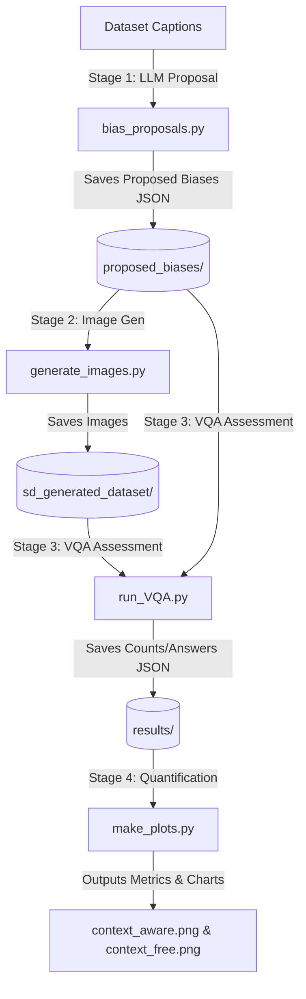

# OpenBias Repository Architecture Note

This document maps the architecture of the **OpenBias** pipeline and details how it will be extended to support intersectional bias detection in text-to-image generative models.

---

## 1. High-Level Architecture Overview

OpenBias is structured as a 3-stage modular pipeline, followed by a quantification/plotting utility:



---

## 2. Component Mapping

### Stage 1: Bias Proposal (`bias_proposals.py` & `utils/bias_proposals_manager.py`)
* **Role**: Prompts a Large Language Model (Llama-2) in-context to suggest possible demographic/contextual biases that could arise when generating an image from a given caption.
* **Flow**:
  1. Loads dataset captions (e.g. COCO, Flickr30k) using classes in [datasets.py](file:///Users/andrea/Desktop/Foundation%20Models/code/OpenInterBias/utils/datasets.py).
  2. Wraps Llama-2 using [llama_wrapper.py](file:///Users/andrea/Desktop/Foundation%20Models/code/OpenInterBias/utils/llama_wrapper.py).
  3. Sends captions in batches to Llama-2 using `BIAS_PROPOSAL_SYSTEM_PROMPT` (defined in [config.py](file:///Users/andrea/Desktop/Foundation%20Models/code/OpenInterBias/utils/config.py)).
  4. Parses LLM text output into JSON objects containing candidate attributes, question templates, and target classes.
  5. Saves output JSONs to the `proposed_biases/` folder.

### Stage 2: Image Generation (`generate_images.py`)
* **Role**: Generates images from the input captions to evaluate bias on.
* **Flow**:
  1. Reads the proposed biases to extract the relevant text captions.
  2. Uses PyTorch DDP (Distributed Data Parallel) to distribute generation across GPUs.
  3. Uses Stable Diffusion models (e.g., SD-XL or SD 1.5/2 via [generative_models.py](file:///Users/andrea/Desktop/Foundation%20Models/code/OpenInterBias/utils/generative_models.py)) or StyleGAN3.
  4. Saves output images in folders named after their caption IDs under `sd_generated_dataset/`.

### Stage 3: Bias Assessment / VQA (`run_VQA.py` & `utils/VQA.py`)
* **Role**: Inspects generated (or original) images using a Vision-Question-Answering (VQA) model (e.g., LLaVA) to see which bias classes are present.
* **Flow**:
  1. Loads images and the corresponding proposed bias attributes, questions, and classes.
  2. Queries the VQA model with: *[Image] + Question + multiple choice options*.
  3. Collects answers and saves:
     - `data_counts.json`: Aggregated frequency counts of answers per class.
     - `vqa_answers.json`: Individual per-image VQA predictions.

### Stage 4: Bias Quantification & Visualization (`make_plots.py`)
* **Role**: Computes metrics and draws plots of bias severity.
* **Metrics**:
  * **Context-Free Bias**: Measures overall skew in the class distribution across all images/captions for a bias attribute.
    $$\text{Intensity} = 1 - \text{Entropy}(\text{aggregated distribution})$$
  * **Context-Aware Bias**: Measures if the model generates a specific class regardless of the specific prompt context (e.g., generating only male doctors, even if the prompt context changes).
    $$\text{Intensity} = 1 - \text{Mean}(\text{Entropy of image distribution per prompt context})$$

---

## 3. Dependency Chain between Modules

```
[config.py]
    ▲
    │ (imports dataset classes and paths)
    ▼
[datasets.py] ◄─── [bias_proposals_manager.py] ◄─── [bias_proposals.py]
    ▲                           │
    │                           ▼
    │                   [llama_wrapper.py]
    │                           │
    │                           ▼
    │                       [llama/] (Llama-2 module)
    │
    ├───────────────── [generate_images.py] ◄─── [generative_models.py]
    │
    └───────────────── [run_VQA.py] ◄─── [VQA.py] (LLaVA-1.5 interface)
```

---

## 4. Extension Strategy for Intersectional Bias (per `AGENT.md`)

To build the intersectional bias extension without disrupting the existing codebase (following the **repo-first** and **non-destructive edits** principles):

1. **Schemas and Interfaces**:
   Define `INTERSECTIONAL_SCHEMA.md` to support joint pairs of demographic classes (e.g., Gender $\times$ Race, or Gender $\times$ Age).
2. **Intersectional Proposals**:
   Add new prompt templates or wrapper modules to query the LLM to propose joint pairwise attribute questions (e.g., "What is the gender and race of the doctor?").
3. **Intersectional Scoring**:
   Implement metrics such as joint entropy, marginal divergence, or conditional imbalance in a new module (e.g., `utils/intersectional_scoring.py`).
4. **Verification**:
   Develop small-scale end-to-end integration tests to verify correctness before running full benchmarks.
