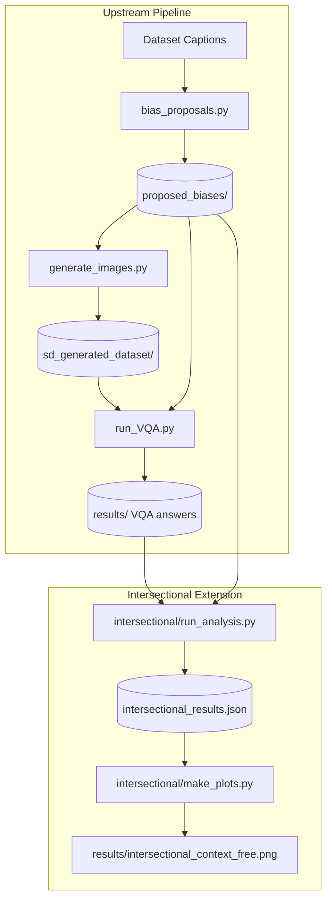

# Intersectional Architecture Note

This document describes how the intersectional bias detection extension integrates with the existing upstream architecture of the **OpenBias** pipeline.

## 1. Upstream Pipeline Overview
As described in [ARCHITECTURE_NOTE.md](file:///Users/andrea/Desktop/Foundation%20Models/code/OpenInterBias/ARCHITECTURE_NOTE.md), the upstream OpenBias pipeline consists of:
1. **Bias Proposal** (LLM Llama-2 generates single-attribute bias prompts/classes).
2. **Image Generation** (Stable Diffusion generates images for captions).
3. **Bias Assessment** (VQA model evaluates single attributes on generated images).
4. **Scoring & Visualization** (Entropy of single attributes is plotted).

---

## 2. Intersectional Extension Integration

To adhere to the core principles of **respecting the original architecture** and **minimizing destructive edits**, the intersectional extension does not modify any upstream execution files. Instead, it runs as a **post-hoc analysis stage** (Stage 5) that reads from the cached outputs of Stage 3 (VQA answers).

### Flow Detail
1. **Pairing Proposals**: The script processes `proposed_biases` to group the multiple single-attribute biases proposed for each caption. It finds all unique pairwise combinations of these attributes (e.g., if a caption has Gender, Race, and Age proposed, it forms Gender x Race, Gender x Age, Race x Age).
2. **VQA Prediction Pairing**: For each generated image, the script loads the single VQA predictions from `vqa_answers.json` for both attributes in a pair (e.g., `gender_pred` and `race_pred`) and combines them into a joint observation `(gender_pred, race_pred)`.
3. **Scoring**: The script aggregates the joint observations and computes intersectional metrics (Normalized Joint Entropy and Mutual Information).
4. **Plotting**: Generates plots displaying the intersectional bias intensities.
